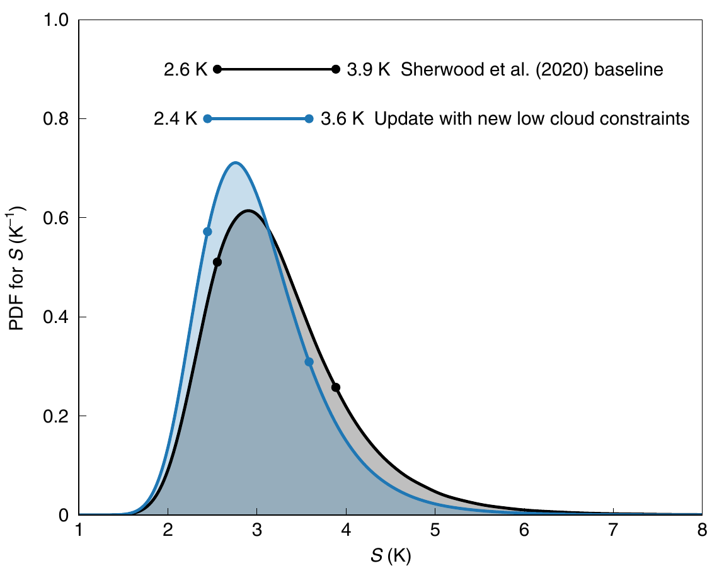

::: {.home-intro}


::: {.intro-copy}

# Timothy A. Myers {.hero-title}


[Associate Research Scientist · Department of Atmospheric Science · University of Wyoming]{.affiliation}

I study how low clouds respond to warming and how their response shapes Earth’s energy budget and climate sensitivity. I combine satellite and ground-based observations with climate-model experiments to identify cloud processes, evaluate model uncertainty, and understand climate variability.


::: {.profile-links}

[View publications](publications.qmd){.primary-link}
[tmyers12 \[at\] uwyo.edu]{.contact-email}
[University profile](https://www.uwyo.edu/atsc/directory/research-scientists/myers.html)
[Google Scholar](https://scholar.google.com/citations?user=nzdByNgAAAAJ&hl=en)
[ORCID](https://orcid.org/0000-0003-0582-4554)

:::


:::


::: {.portrait-frame}

```{=html}

```

:::


:::


::: {.research-section}


## Research


::: {.research-grid}


::: {.research-topic}


### Cloud feedbacks

How do low clouds respond to warming, and what can observations tell us about Earth's climate sensitivity?

:::


::: {.research-topic}


### Model uncertainty

Which physical processes drive uncertainty in simulated low clouds? [Perturbed-parameter ensembles](https://doi.org/10.22541/essoar.15006619/v1) help identify the model assumptions that matter most.

:::


::: {.research-topic}


### Climate variability

How do clouds and ocean temperatures interact, from regional marine heatwaves to basin-scale climate variability?

:::


::: {.research-topic}


### Boundary-layer processes

How well do models represent clouds, thermodynamic structure, and winds within the atmospheric boundary layer?

:::


::: {.research-topic .field-work}


### Field observations

Across [WFIP3](https://doi.org/10.1175/bams-d-25-0201.1) and [PERiLS/VORTEX-USA](https://ams.confex.com/ams/104ANNUAL/webprogram/Paper437537.html), I contributed to field operations and instrument maintenance, and I analyzed ground-based boundary-layer observations from those campaigns and [CHEESEHEAD19](https://doi.org/10.22541/essoar.175408228.87136314/v1). For WFIP3, I also co-developed the campaign's [19-month event log](https://www.osti.gov/biblio/3375897) documenting East Coast weather regimes and the occurrence of marine fog.

:::


:::


:::


::: {.selected-section}


::: {.section-heading}


## Selected findings

[All publications](publications.qmd)

:::


::: {.finding}

[2026 · Communications Earth & Environment]{.eyebrow}

### Recent cloud changes reinforce established constraints

Meteorology and declining sulfate aerosols explain recent low-cloud trends and the extreme 2023 anomaly, supporting established bounds on cloud feedback, aerosol–cloud interactions, and climate sensitivity.

[Recent cloud trends and extremes reaffirm established bounds on cloud feedback and aerosol-cloud interactions](https://doi.org/10.1038/s43247-026-03461-8){.paper-link}

:::


::: {.finding .featured-finding}


::: {.finding-copy}

[2021 · Nature Climate Change]{.eyebrow}

### Observations narrow uncertainty in climate sensitivity

Relationships between clouds and their environment provide observational constraints on how low clouds respond to warming.

[Observational constraints on low cloud feedback reduce uncertainty of climate sensitivity](https://doi.org/10.1038/s41558-021-01039-0){.paper-link}


::: {.recognition}

Featured in *Nature Climate Change*'s [15th-anniversary retrospective on influential papers](https://www.nature.com/articles/s41558-026-02605-0).

:::


:::


```{=html}
<figure class="research-figure">
  
  <figcaption>Updated low-cloud constraints narrow the climate-sensitivity range in a multiple-lines-of-evidence assessment. <a href="https://doi.org/10.1038/s41558-021-01039-0">Myers et al. (2021), Fig. 5.</a></figcaption>
</figure>
```

:::


::: {.finding}

[2023 · Journal of Climate]{.eyebrow}

### The pattern of warming matters

Observations help constrain how the spatial pattern of ocean warming affects cloud feedback.

[Observational constraints on the cloud feedback pattern effect](https://doi.org/10.1175/jcli-d-22-0862.1){.paper-link}

:::


::: {.finding}

[2018 · Geophysical Research Letters]{.eyebrow}

### Clouds helped amplify a marine heatwave

Reduced cloud cover and increased solar heating helped amplify the unprecedented 2014–2015 marine heatwave in the eastern Pacific Ocean.

[Cloud feedback key to marine heatwave off Baja California](https://doi.org/10.1029/2018gl078242){.paper-link}

:::


:::


::: {.media-section}

## Media & recognition

Selected reporting that features my work on clouds, climate sensitivity, model uncertainty, and atmospheric observations.

::: {.media-feature}

[Eos · Editors' Vox · 2024]{.eyebrow}

### [Challenges in evaluating climate sensitivity from climate models](https://eos.org/editors-vox/challenges-in-evaluating-climate-sensitivity-from-climate-models)

I was second author on *Causes of Higher Climate Sensitivity in CMIP6 Models*, which editors of *Geophysical Research Letters* selected as an exceptional paper for the journal's 50th anniversary.

:::

::: {.media-grid}

::: {.media-item}

[Energies Media · 2026]{.eyebrow}

### [DOE and NOAA researchers release 19-month offshore weather event log](https://energiesmedia.com/doe-noaa-offshore-weather-log-energies/)

:::

::: {.media-item}

[The Washington Post · 2022]{.eyebrow}

### [One of climate change's great mysteries is finally being solved](https://www.washingtonpost.com/climate-environment/2022/12/12/climate-change-clouds-equilibrium-sensitivity/)

:::

::: {.media-item}

[Science · 2021]{.eyebrow}

### [U.N. climate panel confronts implausibly hot forecasts of future warming](https://www.science.org/content/article/un-climate-panel-confronts-implausibly-hot-forecasts-future-warming)

:::

::: {.media-item}

[Scientific American · 2021]{.eyebrow}

### [Clouds may speed up global warming](https://www.scientificamerican.com/article/clouds-may-speed-up-global-warming/)

:::

:::

:::
